# Mika's Balatro Mod Collection
This is my mod collection for the game [Balatro](https://store.steampowered.com/app/2379780/Balatro/).

# Mod Incompatibility
This mod is partially incompatible with JellyMod, but there is a partial workaround. As long as you extract JellyMod into a seperate subfolder and keep MikasModCollection inside of the Mods folder, they should be mostly compatible. Your final Mods folder should look something like this: `Appdata/Balatro/Mods` will have `MikasModCollection.lua` and the `assets` folder. Put the JellyMod zip in a new folder `Appdata/Balatro/Mods/JellyMod`, and then extract `JellyMod.zip` there. The Scout Joker from JellyMod breaks things again, but things should be more compatible than before.\
_Thanks to `@Mastahcheech` and `@Cr4zZyBipBiip` for figuring this out_

# Installation
- Requires [Steamodded](https://github.com/Steamopollys/Steamodded/).
- Download the whole mod as a .zip file, then unzip it in `Balatro\Mods`.
- For more information about installing mods, check the [Steamodded readme](https://github.com/Steamopollys/Steamodded?tab=readme-ov-file#how-to-install-a-mod).
- The mod has a config right at the top of the file, to disable any unwanted mods.

# Decks

### Even Steven's Deck
Only even cards. Starts with the **_Even Steven_** joker.

### Odd Todd's Deck
Only odd cards. Starts with the **_Odd Todd_** joker.

### Fibonacci Deck
Only cards from the Fibonacci Sequence _(Ace, 2, 3, 5, 8)_. Starts with the **_Fibonacci_** joker.

### Prime Deck
Only prime cards _(2, 3, 5, 7, Ace)_. Starts with the **_Prime_** joker.

### Midas's Deck
Only Gold Face cards. Starts with the **_Midas Mask_** joker.

### "Jokers for Hire" Deck
All Jokers give +1 Joker slot, but the price of Jokers and Buffoon Packs increase **_exponentially_**.\
_All Jokers also remove the Joker slot again once sold_

# Jokers
## Common
### Alphabet Joker
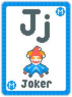\
Gives +20 Chips for every specific letter in all your Jokers. Letter changes when this Joker appears in the shop.\
_An example: If the current letter is 'o' and you have "Cool Joker" and "Joker", you'd get a (3 * 20) + 20 = 80 chip bonus_

### The Banker
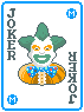\
Earn $2 for every Gold Seal and Gold Card in your whole deck at the end of the round.

### Bomb
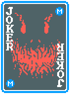\
Gains +15 Mult per round, starting at 15. Self destructs after 3 rounds.\
_Art made by `Grassy`_

### Broke Joker
\
Gains +1 Mult per -$2.

### Glue
\
If you have both the Half Joker and the Incomplete Joker, give +2 Joker slots and X5 Mult.

### Incomplete Joker
\
Give +100 Chips if played hand contains 3 or fewer cards.

### Lucky Number Seven
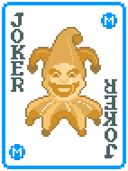\
Gain $1, $3, $10, $25, $50 when 1, 2, 3, 4 or 5 sevens are played, respectively.

### Planetary Alignment
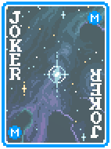\
Once every 2 rounds, Blue Seals give 2 Planet cards. One of these will be for your most played poker hand.

### Prime Joker
\
Gives each played prime number _(2, 3, 5, 7, Ace)_ X1.2 mult when scored.\
_Art made by `Grassy`_

### Rigged Joker
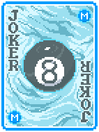\
Once per hand, add +1 to all listed probabilities whenever a **_Lucky_** card does not trigger. Resets every round.\
_Example: 1 in 4 -> 2 in 4 -> 3 in 4_

### Seal Collector
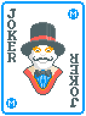\
Gains +25 Chips for every card with a seal, starting at 25 Chips.

### The Stockpiler
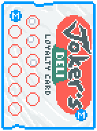\
Gives +1 hand size for every 4 cards in your deck above 52. Caps at the current Ante.\
_So at Ante 1 you can have at most +1 Hand size, at Ante 2 at most +2, etc..._

### Suit Alley
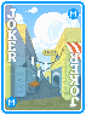\
Diamond and Club cards gain +12 Chips when scored. Heart and Spade cards gain +3 Mult when scored.

## Uncommon
### Camper
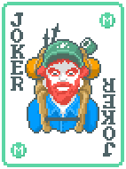\
Every discarded card permanently gains +4 Chips.

### Blackjack Joker
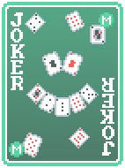\
Gives X3 Mult when the ranks of all played cards adds up to **_exactly 21_**.\
_An Ace can be valued at either 1 or 11_

### Finishing Blow
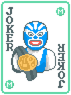\
If a blind is finished with a **_High Card_**, randomly enhance played cards.\
_Does not work on already enhanced cards_

### The Fisherman
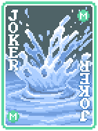\
Gives +1 hand size per discard, -1 hand size per hand played _(but hand size effect can't be negative)_. Resets every round.

### Football Card
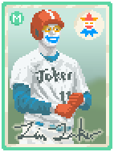\
Gives +50 Chips for every Common Joker.

### The Gambler
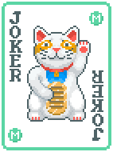\
Retrigger all played **_Lucky_** cards.

### Harp Seal
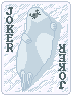\
Doubles the effect of all Seals.\
_Art made by `Grassy`_

### Impatient Joker
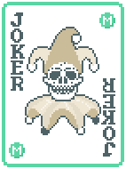\
Gives +3 mult per discarded card. Resets every round.

### Shy Joker
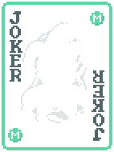\
Gain X0.01 Mult for every card played, starting at X1 Mult.

### Special Edition Joker
\
Gains +2 Mult per Seal, +10 Chips per Enhancement and X0.1 Mult per Edition for every card in your deck.

### Statistic Joker
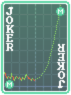\
If at least 4 poker hands have been played the same amount of times, gives X4 Mult.\
_Does not count unplayed poker hands_

### Student Loans
\
Go up to -$100 in debt. Gives -1 discard for every -$25 in debt.

### What Are The Odds
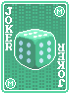\
If 4 Lucky cards trigger in one hand, create a random **_negative_** Joker.\
_If a Lucky card triggers on both Mult and money, it counts as 2 triggers. Retriggers also count as seperate triggers_

## Rare
### Batman
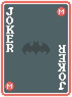\
Gains +1 Mult for every **_non lethal_** hand played. Mult gain increases by +1 for every Joker with "Joker" in the name.\
_A non lethal hand is a hand that does not finish off a blind_

### Boating License
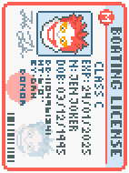\
Copies the effect of all played **_Enhanced_** cards.

### The Commander
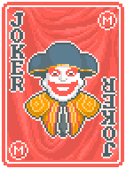\
If the first hand of the round has only 1 card, give it a random **_Enhancement_**, **_Seal_** and **_Edition_**. 

### Cultist
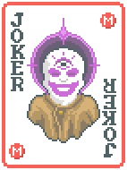\
Gains +X1 mult per hand played, starting at X1. Resets every round.

### Delayed Joker
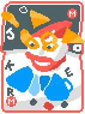\
Gives 20 Mult, 100 Chips and X1.5 Mult on the 4th action.\
_An action is either playing a hand or discarding_

### Historical Joker
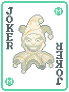\
If scored cards have the same **_ranks_** and **_order_** as the previous hand, add previous hand's Chips to the current hand. Caps at 10% of the current blind's Chips.

### The Show-Off
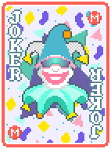\
Gains +X1 Mult a blind is finished with **_2x_** the chip requirement.

### Grudgeful Joker
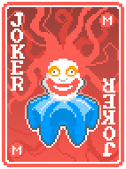\
Add excess Chips from last blind to the first hand of the current round. Caps at 10% of the current blind's Chips.

### The Printer
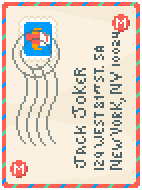\
If a hand scores more than the blind's required Chips, duplicate the played hand and add cards to your hand.

### The Sniper
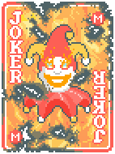\
Gains +X4 Mult when a blind is finished with the **_exact_** chip requirement.

### Straight Nate
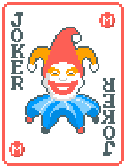\
Gives X4 mult if the hand contains a straight and you have both the **_Odd Todd_** and **_Even Steven_** jokers. Also gives 1 extra joker slot.

## Legendary
### Dagonet
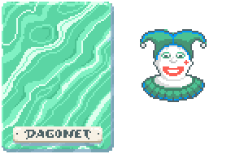\
Doubles all base values on Jokers.
