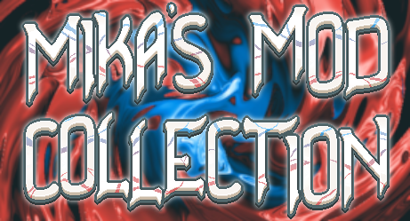

    

 

# Mika's Balatro Mod Collection
This is my mod collection for the game [Balatro](https://store.steampowered.com/app/2379780/Balatro/), containing 60 Jokers, 2 Tarots, 1 Spectral and 7 Decks.

# Installation
- Requires [Steamodded](https://github.com/Steamopollys/Steamodded/) version 0.9.5 or higher.
- Requires [Lovely](https://github.com/ethangreen-dev/lovely-injector) version 0.4.0 or higher.
- Download the whole mod as a .zip file, then unzip it in `Appdata/Balatro/Mods`. Make sure the mod is in it's own folder.
- For more information about installing mods, check the [Steamodded readme](https://github.com/Steamopollys/Steamodded?tab=readme-ov-file#how-to-install-a-mod).
- The mod has a config right at the top of the file, in case you want to disable something in specific.

# Info
For information about all the Jokers and other things in this mod, check out [the website](https://MikaSchoenmakers.github.io/MikasBalatro/).

# Decks
### Even Steven's Deck
Only even cards. Starts with the **_Even Steven_** joker.

### Odd Todd's Deck
Only odd cards. Starts with the **_Odd Todd_** joker.

### Fibonacci Deck
Only cards from the Fibonacci Sequence _(Ace, 2, 3, 5, 8)_. Starts with the **_Fibonacci_** joker.

### Prime Deck
Only prime cards _(2, 3, 5, 7, Ace)_. Starts with the **_Prime Time_** joker.

### Midas's Deck
Only Gold Face cards. Starts with the **_Midas Mask_** joker.

### "Jokers for Hire" Deck
All Jokers give +1 Joker slot, but the price of Jokers and Buffoon Packs **_increases_** per Joker.\
_The exact formula is: `Base Price * Number of Jokers`. All Jokers also remove the Joker slot again once sold_

### Perfect Precision Deck
+1 hands, discards and hand size. Start with a negative **_The Sniper_** joker. Ante scales X1.5 as fast.
